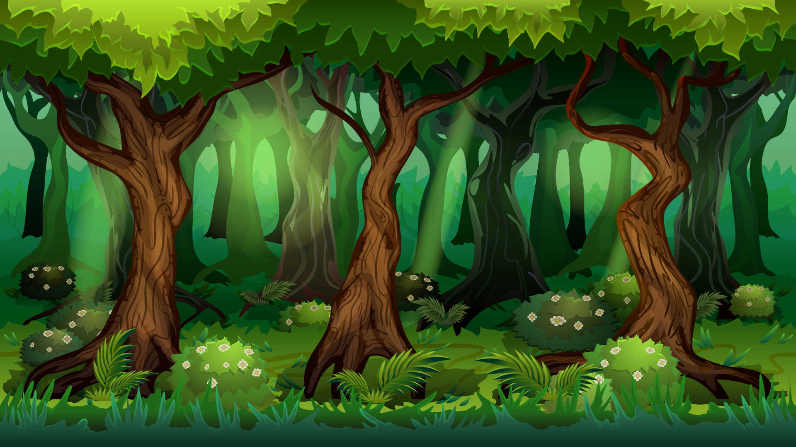

<h1 align='center'> 
  &#9829 
  Kingdom Coinquest 
  &#9824 
</h1>
 

<body align='center' >

 by
  Tello
  V
  i
  s
  i
  o
  n
   Studio
   
  <h3 style="color:#FFFFFF">Turn an ordinary deck of cards into a strategic battle for Kingdom Conquest!</h3>
   
  
 

<h2 style="color:#FFFFFF"> The Deck of the Four Kingdoms is rife with conflict. You must crown your king, hone your steel, and command your people. Do you have the strategic mind to defeat your rival kings? Or, will your name fade with time? It's time to breathe life into that old deck of cards!</h2>
</body>

  
 

 
 
<h2 align='center' style='color:#FFFFFF'> Card Types </h2>

<b>King:</b>

Your king is your primary concern. The king starts the game with xxxx health. Your job is to protect your king, while defeating the other king. A king is defeated when he has 0 or less health.
Non-Player Kings: 
These kings are not used in game, they are set aside outside of the play area.

Queen: 
The queen of your suit, when held, can be played next to your king. She can be used as a bodyguard for your King. Her health is drained in place of his. The queen is active until health has reached 0 or less. If you have a Queen in play, and no Knight, the Queen must then be used to block the king no matter what. All Queens enter the game with 30 health points and a defensive score of 10.
Non-Player Queen: 
Collecting any 2 Queens, that don’t belong to your army, can be converted into 1 queen of your own. Only 1 Queen can be active per player at a time. The Queen stays in play until she has been defeated. Defeated is when the Queen has 0 or less health.

Jack: 
The jack of your suit, when held, can be played as either another Knight or Peasant until defeated. His unit type must be chosen upon play. Jack’s equipped resource must be prepared as if he was actually a Knight or Peasant. Once chosen, the Jack remains the chosen unit type until defeat. Defeat is when Jack has 0 or less health.

Ace: 
The ace of your suit can be used to resurrect the top discard card and place it on your unit of choice for immediate use. Aces used to resurrect, must be placed at the bottom of the discard pile. Do not shuffle the discard pile when placing an Ace at the bottom of the pile.

Non-Player Ace: 
Be careful how you handle this card, if the opponent can retrieve his ace from the top of the discard then they may use it against you!

Numbered Suits: 
	These cards represent weapons, armor, and mana. The Quartermaster prepares these resources for use by your Units. The value of the card influences its effect and preparation cost.

Non-Player Numbered Suits: 
Represent armies of other nations. Collecting 2 cards of the same value from non-player nations counts as one card of your suit. Play this card as if it were your own, preparation by quartermaster still necessary.

Unit Types

Quartermaster: 
The preparer and provider of weapons, armor and mana for your units. Each resource needs to be prepared by the quartermaster in order to use (unless stated otherwise). 

Preparation Costs
2-4 	= 1 turn preparation
5-7 	= 2 turns preparation
8-10 	= 3 turns preparation

 
<strong>Videos</strong>

 
 
 
 

